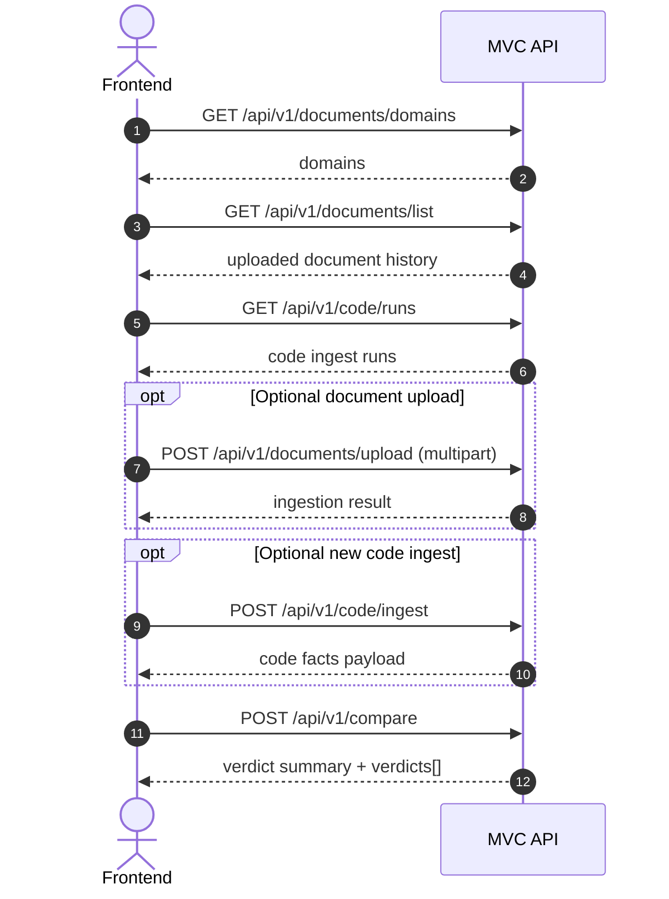

# MVC API Frontend Integration Guide

## What This Backend Is For

The MVC API (Model vs Code API) is a compliance-focused backend that helps teams validate whether trading or risk-system code actually implements what model or policy documents require. It bridges two very different sources of truth: unstructured regulatory/model documentation and structured application code in GitLab. Instead of reviewing both manually line by line, the API provides a workflow that turns each side into comparable units and returns explicit verdicts.

On the document side, the API uploads and indexes model documents by business domain so they can be queried semantically with source-backed evidence. On the code side, the API fetches source files from GitLab, parses them with AST-based extraction, and normalizes key logic into code facts (expressions, operators, dependencies, and business intent). This gives your frontend stable artifacts like domains, uploaded document history, code ingest runs, and normalized facts that can be selected and reviewed.

The compare endpoint is the orchestration layer that ties this together for your single-page UI. For each selected code fact, it retrieves the closest relevant rule text from the document corpus and asks the verdict engine to classify alignment as Aligned, Partial, Misaligned, or Unrelated, including discrepancies and evidence references. In practice, this enables a reviewer-friendly experience where users can triage gaps quickly, inspect exact rule/code mismatches, and track implementation quality over time.

## Purpose

This guide gives you everything needed to build a frontend, especially a single comparison page that compares model documents against code implementation.

It covers:

1. Endpoints and payload contracts.
2. Recommended frontend configuration.
3. Error handling patterns.
4. End-to-end UI flow for the compare page.
5. Copy-paste examples for Fetch and Axios.

## Base URLs and API Surface

Local development defaults:

* API base URL: http://localhost:8000
* Swagger: http://localhost:8000/docs
* OpenAPI JSON: http://localhost:8000/openapi.json
* Health: http://localhost:8000/health
* Versioned health: http://localhost:8000/api/v1/health

Primary API prefix:

* `/api/v1`

Current endpoints:

1. GET `/health`
2. GET `/api/v1/health`
3. GET `/api/v1/documents/domains`
4. GET `/api/v1/documents/list`
5. POST `/api/v1/documents/upload`
6. POST `/api/v1/documents/query`
7. GET `/api/v1/code/runs`
8. POST `/api/v1/code/extract`
9. POST `/api/v1/code/ingest`
10. POST `/api/v1/compare`

## High-Level Flow for a Single Compare Page

**Recommended user journey:**

1. Load domains and existing artifacts.
2. Let user upload model documents if needed.
3. Let user ingest a code file from GitLab if needed.
4. Let user choose `run_id` + `domain`.
5. Call compare endpoint.
6. Render verdict summary and per-fact evidence.

**Suggested sequence:**



---

## Authentication and Security Notes

**Frontend to backend:**

* No JWT or custom token is currently required by MVC API endpoints.
* Requests are plain HTTP calls to MVC API.

**Backend to upstream services:**

* Backend fetches TEA token internally for KM and Chinou.
* Backend uses `GITLAB_TOKEN` server-side for GitLab fetch.

**CORS:**

* Current server allows all origins, methods, and headers.
* This is convenient for development.
* For production, restrict allowed origins to your frontend host(s).

## Environment Configuration for Frontend

Suggested frontend environment variables:

1. `VITE_MVC_API_BASE_URL`
2. `VITE_MVC_API_TIMEOUT_MS`
3. `VITE_MVC_API_RETRIES`

Example `.env.development`:

```env
VITE_MVC_API_BASE_URL=http://localhost:8000
VITE_MVC_API_TIMEOUT_MS=60000
VITE_MVC_API_RETRIES=1

```

Example API client bootstrap (Axios):

```typescript
import axios from "axios";

const api = axios.create({
  baseURL: import.meta.env.VITE_MVC_API_BASE_URL,
  timeout: Number(import.meta.env.VITE_MVC_API_TIMEOUT_MS ?? 60000),
});

api.interceptors.response.use(
  (res) => res,
  (err) => {
    const status = err?.response?.status;
    const detail = err?.response?.data?.detail;
    return Promise.reject({
      status,
      detail,
      message: typeof detail === "string" ? detail : "Request failed",
      raw: err,
    });
  }
);

export default api;

```

---

## Endpoint Contracts

### 1) Health

**Method and path:**

* GET `/health`
* GET `/api/v1/health`

**Success response:**

```json
{
  "status": "ok"
}

```

**Frontend usage:**

* Run once at app startup to show backend connectivity.

### 2) List Allowed Document Domains

**Method and path:**

* GET `/api/v1/documents/domains`

**Success response:**

```json
{
  "default_domain": "rtb",
  "domains": ["rtb", "sbi", "exposure", "margin"]
}

```

**Frontend usage:**

* Populate domain dropdown.
* Pre-select `default_domain`.

---
### 3) List Uploaded Documents

**Method and path:**

* GET `/api/v1/documents/list`

**Success response:**

```json
{
  "documents": [
    {
      "filename": "RTB_Model_Policy_v3.pdf",
      "domain": "rtb",
      "uploaded_at": "2026-08-23T09:12:10.113Z",
      "saved_path": "C:/.../uploads/documents/RTB_Model_Policy_v3.pdf",
      "metadata_path": "C:/.../uploads/metadata/RTB_Model_Policy_v3_metadata.json",
      "ingestion_status": "ingested",
      "was_added": true
    }
  ]
}

```

**Frontend usage:**

* Show uploaded documents panel.
* Filter by domain.
* Show ingestion status chips.

---

### 4) Upload and Ingest a Document

**Method and path:**

* POST `/api/v1/documents/upload`
* Content-Type: `multipart/form-data`

**Form fields:**

1. `file`: File (required)
2. `domain`: string (optional, defaults to `rtb`)

**Fetch example:**

```javascript
const form = new FormData();
form.append("file", fileInput.files[0]);
form.append("domain", selectedDomain);

const res = await fetch(`${baseUrl}/api/v1/documents/upload`, {
  method: "POST",
  body: form,
});

if (!res.ok) throw await res.json();
const data = await res.json();

```

**Success response (201 Created):**

```json
{
  "filename": "RTB_Model_Policy_v3.pdf",
  "domain": "rtb",
  "saved_path": "C:/.../uploads/documents/RTB_Model_Policy_v3.pdf",
  "metadata_path": "C:/.../uploads/metadata/RTB_Model_Policy_v3_metadata.json",
  "ingestion_result": {
    "status": "ingested",
    "was_added": true,
    "filename": "RTB_Model_Policy_v3.pdf"
  }
}

```

**Validation and error scenarios:**

1. *Invalid extension:*

```json
{
  "detail": [
    {
      "message": "Unsupported file type '.exe'.",
      "allowed_extensions": [".docx", ".pdf", ".txt"]
    }
  ]
}

```

2. *Unsupported domain:*

```json
{
  "detail": [
    {
      "message": "Unsupported domain 'abc'.",
      "allowed_domains": ["rtb", "sbi", "exposure", "margin"]
    }
  ]
}

```

3. *Upstream KM failure:*

```json
{
  "detail": "Knowledge Management API ingestion error: <reason>"
}

```

---

### 5) Query Ingested Documents

**Method and path:**

* POST `/api/v1/documents/query`
* Content-Type: `application/json`

**Request body:**

```json
{
  "question": "What is the expected risk weighting approach for SBL positions?",
  "domain": "rtb",
  "prompt_type": "analysis",
  "search_profile": "balanced"
}

```

**Field notes:**

1. `prompt_type` options: `default`, `classification`, `analysis`, `audit`, `business`, `rtb`, `user`, `development`
2. `search_profile` options: `precise`, `balanced`, `comprehensive`

**Success response:**

```json
{
  "question": "What is the expected risk weighting approach for SBL positions?",
  "answer": "The policy requires ...",
  "sources": [
    {
      "source_location": {
        "document_name": "RTB_Model_Policy_v3.pdf",
        "chunk_index": 43,
        "document_type": "pdf",
        "match_type": "semantic",
        "similarity_score": 0.89,
        "context": "For securities borrowing/lending positions, ...",
        "url": null
      }
    }
  ]
}

```

---

### 6) List Code Ingest Runs

**Method and path:**

* GET `/api/v1/code/runs`

**Success response:**

```json
{
  "runs": [
    {
      "run_id": "20260819_141851_market_risk_engine",
      "created_at": "20260819_141851",
      "file_path": "risk/market_risk_engine.py",
      "language": "python",
      "facts_total": 37,
      "key_calculation_count": 9,
      "llm_refined": true,
      "llm_skip_reason": null,
      "artifact_path": "C:/.../code/facts/20260819_141851_market_risk_engine_facts.json"
    }
  ]
}

```

**Frontend usage:**

* Populate run selector for compare form.
* Show badges for `llm_refined` and `llm_skip_reason`.

---

### 7) Extract Code Chunks from GitLab

**Method and path:**

* POST `/api/v1/code/extract`
* Content-Type: `application/json`

**Request body:**

```json
{
  "url": "https://gitlab.nomura.com/group/repo/-/blob/master/src/trade_handler.py",
  "branch": null,
  "key_only": false
}

```

**Success response shape:**

```json
{
  "file_path": "src/trade_handler.py",
  "language": "python",
  "metadata": {
    "url": "https://gitlab.nomura.com/group/repo/-/blob/master/src/trade_handler.py",
    "branch": "master",
    "requested_at": "2026-08-23T09:20:10.000Z"
  },
  "chunk_count": 12,
  "key_calculation_count": 4,
  "imports_in_file": ["import pandas as pd"],
  "chunks": [
    {
      "chunk_id": "src/trade_handler.py::TradeHandler::compute_margin",
      "type": "method",
      "name": "compute_margin",
      "qualified_name": "TradeHandler.compute_margin",
      "signature": "def compute_margin(self, exposure_df: pd.DataFrame) -> float:",
      "docstring": "Computes margin for portfolio.",
      "source_code": "def compute_margin(...): ...",
      "start_line": 117,
      "end_line": 163,
      "parent_context": {
        "type": "class",
        "name": "TradeHandler",
        "docstring": null,
        "bases": ["BaseHandler"]
      },
      "decorators": [],
      "is_key_calculation": true
    }
  ]
}

```

**Common failures:**

1. *Bad URL parse (400):*

```json
{
  "detail": "Cannot parse GitLab URL ... Expected: https://gitlab.nomura.com/group/repo/-/blob/branch/path/to/file"
}

```

2. *Missing or invalid GitLab token (401):*

```json
{
  "detail": "GITLAB_TOKEN is not configured. Set the GITLAB_TOKEN environment variable."
}

```

3. *File not found (404):*

```json
{
  "detail": "File not found in repository: 'src/missing.py'"
}

```

4. *Unsupported extension (400):*

```json
{
  "detail": "Unsupported extension '.c'. Supported: .c, .cc, .cpp, .cs, .cxx, .h, .hpp, .java, .js, .jsx, .py, .ts, .tsx"
}

```

5. *Parse failure (422):*

```json
{
  "detail": "Parse error ..."
}

```
### 8) Ingest Code and Produce Code Facts

**Method and path:**

* POST `/api/v1/code/ingest`
* Content-Type: `application/json`

**Request body:**

```json
{
  "url": "https://gitlab.nomura.com/group/repo/-/blob/master/src/trade_handler.py",
  "branch": null,
  "key_only": false
}

```

**Success response shape:**

```json
{
  "source_metadata": {
    "file_path": "src/trade_handler.py",
    "language": "python",
    "chunk_count": 12,
    "key_calculation_count": 4,
    "imports_in_file": ["import pandas as pd"]
  },
  "normalization_summary": {
    "facts_total": 20,
    "formula_facts": 8,
    "condition_facts": 4,
    "aggregation_facts": 3,
    "constant_facts": 1,
    "data_dependency_facts": 2,
    "function_dependency_facts": 1,
    "unclassified_facts": 1
  },
  "code_facts": [
    {
      "fact_id": "CF-0001",
      "fact_type": "formula",
      "name": "compute_margin",
      "qualified_name": "TradeHandler.compute_margin",
      "origin": {
        "file_path": "src/trade_handler.py",
        "qualified_name": "TradeHandler.compute_margin",
        "start_line": 117,
        "end_line": 163
      },
      "logic": {
        "canonical_expression": "return exposure * haircut rate",
        "operators": ["*"],
        "functions_called": ["max"]
      },
      "semantics": {
        "business_intent": "Compute margin from exposure and haircut",
        "is_key_calculation": true,
        "confidence": 0.92
      },
      "evidence": {
        "code_snippet": "def compute_margin(...): ...",
        "decorators": []
      },
      "embedding_text": "Type: formula ..."
    }
  ],
  "chunk_index": [
    {
      "chunk_id": "src/trade_handler.py::TradeHandler::compute_margin",
      "qualified_name": "TradeHandler.compute_margin",
      "type": "method",
      "start_line": 117,
      "end_line": 163,
      "fact_ids": ["CF-0001"]
    }
  ],
  "normalization_warnings": [],
  "llm_refined": true,
  "llm_skip_reason": null
}

```

**Frontend usage:**

* If user ingests new code, immediately refresh `GET /api/v1/code/runs`.
* Use `run_id` from runs endpoint for comparison.

---

### 9) Compare Code Facts Against Model Rules

**Method and path:**

* POST `/api/v1/compare`
* Content-Type: `application/json`

**Request body:**

```json
{
  "run_id": "20260819_141851_market_risk_engine",
  "domain": "rtb",
  "fact_ids": null,
  "key_only": false,
  "search_profile": "comprehensive"
}

```

**Field notes:**

1. `run_id` is the code facts filename stem without `_facts.json`.
2. `fact_ids` is optional and allows selective re-check on chosen facts.
3. `key_only` compares only facts marked `is_key_calculation=true`.
4. `search_profile` options: `precise`, `balanced`, `comprehensive`.

**Success response:**

```json
{
  "run_id": "20260819_141851_market_risk_engine",
  "domain": "rtb",
  "compared_at": "2026-08-23T09:45:10.000000+00:00",
  "total_facts_in_run": 37,
  "facts_compared": 37,
  "summary": {
    "total": 37,
    "aligned": 19,
    "partial": 9,
    "misaligned": 5,
    "unrelated": 4
  },
  "verdicts": [
    {
      "fact_id": "CF-0007",
      "qualified_name": "RiskEngine.calculate_rwa",
      "fact_type": "formula",
      "verdict": "Partial",
      "confidence": 0.86,
      "reasoning": "Formula is mostly aligned but missing floor constraint.",
      "discrepancies": [
        {
          "type": "missing_constraint",
          "description": "Code does not apply the regulatory minimum floor of 0.15.",
          "rule_text": "Risk weight floor shall be 15% ...",
          "code_location": "calculate_rwa: return risk_weight * exposure"
        }
      ],
      "rule_reference": {
        "document_name": "RTB_Model_Policy_v3.pdf",
        "chunk_index": 77,
        "similarity_score": 0.91,
        "rule_text": "Risk weight floor shall be 15% ..."
      }
    }
  ],
  "artifact_path": "C:/.../code/verdicts/20260823_094510_market_risk_engine_verdicts.json"
}

```

**Possible error responses:**

1. *Unknown run_id (404):*

```json
{
  "detail": "No facts artifact found for run_id '...'. Expected: ..."
}

```

2. *Invalid/malformed facts artifact (422):*

```json
{
  "detail": "Failed to parse facts artifact: ..."
}

```

3. *Filters removed all facts (400):*

```json
{
  "detail": "No facts matched the given filters. Check run_id, fact_ids, and key_only."
}

```

4. *KM/TEA client init failed (503):*

```json
{
  "detail": "Could not initialise KM client: ..."
}

```
## Suggested Frontend Data Model

TypeScript interfaces:

```typescript
export type Verdict = "Aligned" | "Partial" | "Misaligned" | "Unrelated";

export interface CompareSummary {
  total: number;
  aligned: number;
  partial: number;
  misaligned: number;
  unrelated: number;
}

export interface Discrepancy {
  type:
    | "wrong_value"
    | "missing_constraint"
    | "wrong_formula"
    | "missing_logic"
    | "wrong_operator"
    | "unimplemented";
  description: string;
  rule_text?: string | null;
  code_location?: string | null;
}

export interface FactVerdict {
  fact_id: string;
  qualified_name: string;
  fact_type: string;
  verdict: Verdict;
  confidence: number;
  reasoning: string;
  discrepancies: Discrepancy[];
  rule_reference?: {
    document_name: string;
    chunk_index: number;
    similarity_score: number;
    rule_text: string;
  } | null;
}

export interface CompareResponse {
  run_id: string;
  domain: string;
  compared_at: string;
  total_facts_in_run: number;
  facts_compared: number;
  summary: CompareSummary;
  verdicts: FactVerdict[];
  artifact_path?: string | null;
}

```

---

## Error Handling Strategy for UI

Backend error detail can be:

1. A string.
2. A structured object.

Use one normalizer in frontend:

```typescript
type ApiError = {
  status: number;
  message: string;
  detail?: unknown;
};

export function normalizeApiError(err: any): ApiError {
  const status = err?.status ?? err?.response?.status;
  const detail = err?.detail ?? err?.response?.data?.detail;

  if (typeof detail === "string") {
    return { status, message: detail, detail };
  }

  if (detail && typeof detail === "object") {
    const msg = (detail as any).message ?? "Request failed";
    return { status, message: msg, detail };
  }

  return { status, message: "Unexpected API error", detail };
}

```

**UI recommendations:**

1. Show top-level toast with message.
2. Show expandable detail JSON for technical users.
3. For 422 domain errors, highlight the domain selector and present allowed domains.
4. For 401 GitLab token errors, show admin hint that backend env needs token setup.

---

## Compare Page UI Contract (Practical)

**Minimum controls:**

1. Domain selector (from GET domains)
2. Run selector (from GET code/runs)
3. Key only toggle
4. Search profile selector (precise, balanced, comprehensive)
5. Optional fact multi-select for targeted compare
6. Compare button

**Minimum output sections:**

1. Summary cards (Aligned, Partial, Misaligned, Unrelated, Total)
2. Verdict table with filters and sort
3. Verdict details side panel with:
* reasoning
* discrepancies
* source rule text
* source document and chunk index


**Recommended sorting for triage:**

1. Misaligned first
2. Partial second
3. Unrelated third
4. Aligned last

---

## Example: End-to-End Compare from Frontend

```typescript
import api from "./api";

export async function runCompare(params: {
  runId: string;
  domain: string;
  keyOnly: boolean;
  searchProfile: "precise" | "balanced" | "comprehensive";
  factIds?: string[];
}) {
  const payload = {
    run_id: params.runId,
    domain: params.domain,
    fact_ids: params.factIds?.length ? params.factIds : null,
    key_only: params.keyOnly,
    search_profile: params.searchProfile,
  };

  const res = await api.post("/api/v1/compare", payload);
  return res.data;
}

```

---

## Backend Runtime Configuration Required for This Frontend

For full feature availability, backend runtime must have:

1. `GITLAB_TOKEN` configured for `/code/extract` and `/code/ingest`.
2. TEA helper available for KM and Chinou calls.
3. `KM_BASE_URL` reachable for documents/query and compare retrieval.
4. `CHINOU_BASE_URL` reachable for verdict adjudication.

Without these, basic endpoints still work:

* Health
* Domains
* Local history endpoints when artifacts already exist

---

## Known Gaps Relevant to Frontend

Current API has no endpoint to list saved compare artifacts directly.

**Current workaround:**

1. Store compare response client-side if you need session replay.
2. Re-run compare for deterministic refresh (except LLM nondeterminism).

**If needed, a future endpoint can be added:**

* GET `/api/v1/compare/runs`
* GET `/api/v1/compare/runs/{id}`

---

## Quick Test Checklist for Frontend Integration

1. Health check succeeds.
2. Domain dropdown loads.
3. Document list loads with empty-state handling.
4. Code runs list loads with empty-state handling.
5. Upload document handles 201 and 422 extension/domain errors.
6. Ingest code handles 200 and GitLab-related errors.
7. Compare handles summary and verdict rendering.
8. Compare handles no-facts and missing-run errors gracefully.